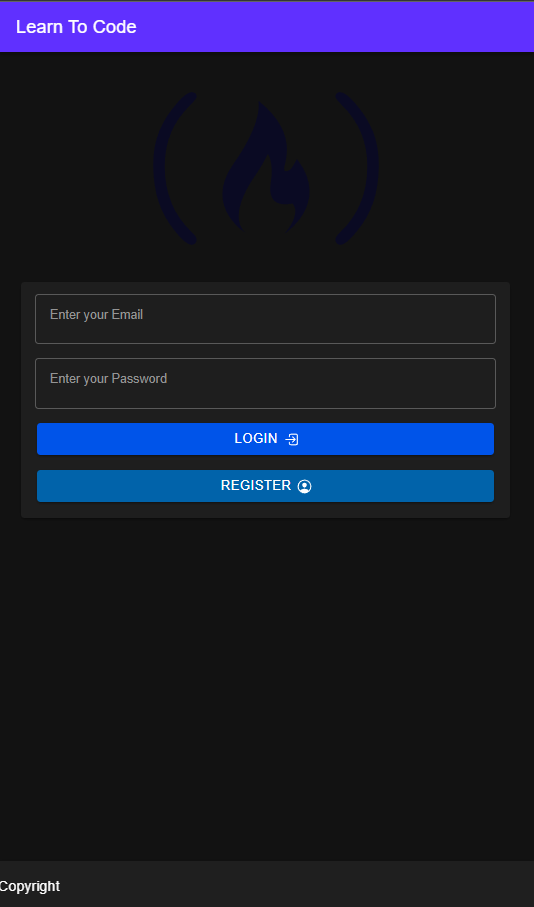
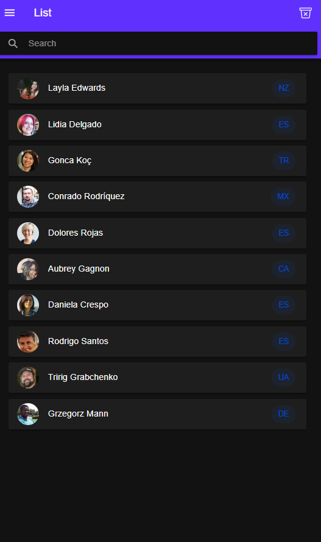

# Ionic Capactior Basic

This is demo application using ionic and capactior and made by using a project from freeCodeCamp youtube video https://www.youtube.com/watch?v=K7ghUiXLef8&t=4096s&ab_channel=freeCodeCamp.org

Just for learning purpose.

Most of the stuff I code are same as in the video

# Start the project
To install dependencies, run `npm i`
and then to run the project `ionic serve`

# Preview

  

